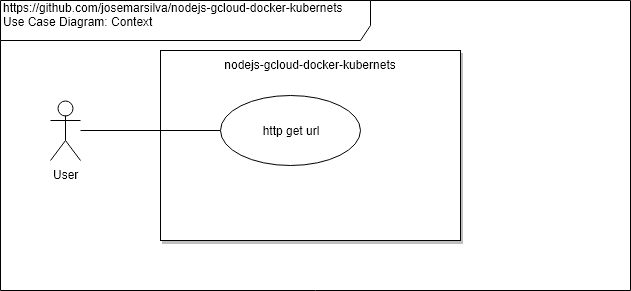
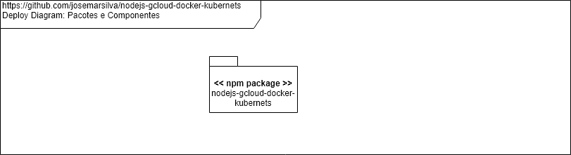

# nodejs-gcloud-docker-kubernets

## 1. Introdução ##

Este repositório contém os artefatos do projeto **nodejs-gcloud-docker-kubernets**. A aplicação NodeJS é um simples servidor HTTP que responde HelloWorld quando chamado. Os demais scripts fazem parte do deploy no ambiente **GCloud**.


### 2. Documentação ###

### 2.1. Diagrama de Caso de Uso ###




### 2.2. Diagrama de Implantação




## 3. Projeto ##

### 3.1. Pré-requisitos ###

* Node.js v10.14.1 (recomendada)


### 3.2. Guia para Desenvolvimento ###

 

### 3.3. Guia para Configuração ###


### 3.3.1. Instalação de pacotes e dependências ###

#### a. Inicialização do projeto NodeJs no diretorio

```cmd
C:\> npm init
<enter>
   :
<enter>
```

#### b. Instalando NPM Packages `express`, `bootstrap` and dependencies `jquery@1.9.1`

```cmd
C:\>  npm install express 
C:\>  npm install jquery@1.9.1
C:\>  npm install popper.js@^1.14.7 -S
C:\>  npm install bootstrap
```

### 3.4. Guia para Implantação ###

* n/a


### 3.5. Guia para Teste ###

* Step-01: Run application

```cmd
C:\> node index.js
nodejs-gcloud-docker-kubernets listening on port 8080
```

* Step-02: Using browser get url `http://localhost:8080` and see result

```cmd
Hello World!
```


### 3.6. Guia para Execução ###

* n/a


### 3.7. Guia de Credenciais de Acesso ###

* n/a


## Referências ##

* [Install NodeJS](https://blog.teamtreehouse.com/install-node-js-npm-windows)
* [Download NodeJS](https://nodejs.org/en/download/)
* [Node.js Tutorial for Beginners: Learn Node in 1 Hour | Mosh](https://www.youtube.com/watch?v=TlB_eWDSMt4)

* [Kubernetes + Google Cloud + Docker: Getting Started](https://www.youtube.com/watch?v=GTRS9zRWs80)